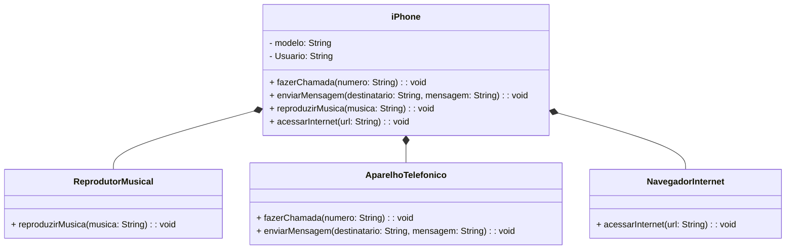

```mermaid
classDiagram
    class iPhone {
        - modelo: String
        - Usuario: String
        + fazerChamada(numero: String): void
        + enviarMensagem(destinatario: String, mensagem: String): void
        + reproduzirMusica(musica: String): void
        + acessarInternet(url: String): void
    }

    class ReprodutorMusical {
        + reproduzirMusica(musica: String): void
    }

    class AparelhoTelefonico {
        + fazerChamada(numero: String): void
        + enviarMensagem(destinatario: String, mensagem: String): void
    }

    class NavegadorInternet {
        + acessarInternet(url: String): void
    }

    iPhone *-- ReprodutorMusical
    iPhone *-- AparelhoTelefonico
    iPhone *-- NavegadorInternet

```
