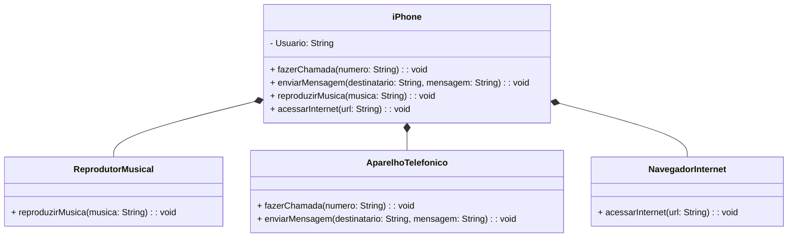

##  POO - Desafio - Lançamento iPhone 2007

Como desafio do Bootcamp Santander 2023 foi realizada a Modelagem e diagramação da representação em UML e Código no que se refere ao componente iPhone.

Baseado no vídeo de lançamento do iPhone foi elabora em uma ferramenta de UML com uso de IA a diagramação das classes e interfaces com a proposta de representar os papéis do iPhone de: Reprodutor Musicial, Aparelho Telefônico e Navegador na Internet. Logo após, foi implementada as classes e interfaces no formato de arquivos .java

### Comportamentos implementados:

    Repodutor Musicial: tocar, pausar, selecionarMusica
    Aparelho Telefônico: ligar, atender, iniciarCorrerioVoz
    Navegador na Internet: exibirPagina, adicionarNovaAba, atualizarPagina

